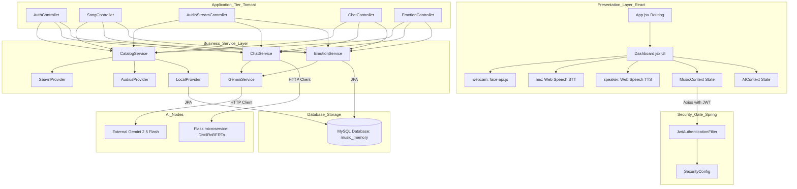

# AuraBeat: Emotion-Aware Music Generator & AI Voice Assistant
## Complete Software Project Report & System Documentation

This document provides professional-grade engineering documentation for the **AuraBeat** platform. It analyzes every folder, component, service, API endpoint, routing loop, database schema, algorithm, and security configurations, serving as full-stack capstone documentation and onboarding material.

---

## Chapter 1: Project Overview

### Project Title
**AuraBeat: Emotion-Aware Music Generator & AI Voice Assistant**

### Objective
The core objective of AuraBeat is to architect a multi-modal desktop and web streaming client that adapts its playback states, catalog lookup matching, and application routes. It uses facial expressions, conversational speech prompts, and text-based sentiments to detect user emotion and adapts the user experience in real-time.

```
       [User Interaction inputs]
        /         |         \
   (Webcam)    (Speech)    (Text Chat)
      │           │           │
      ▼           ▼           ▼
┌──────────────────────────────────────────┐
│   AuraBeat Unified Emotion Classifier    │
└───────────────────┬──────────────────────┘
                    ▼
┌──────────────────────────────────────────┐
│    Dynamic Audio Queue & Playback        │
└──────────────────────────────────────────┘
```

### Problem Statement
Traditional music streaming software (e.g., Spotify, YouTube Music) is passive and isolates audio playlists from the user’s real-time psychological, physiological, and emotional context. Accessing these services forces users to navigate complex visual hierarchies, creating high-screen-time console layouts. 

Additionally, modern browsers enforce strict Cross-Origin Resource Sharing (CORS) security guidelines. For full-stack developers utilizing raw media files hosted on third-party Content Delivery Networks (CDNs) rather than complex custom streaming infra, browser-side audio elements fail to fetch external bytes due to the lack of permissive CORS headers.

### Existing System vs. Proposed Solution

| Dimension | Existing Systems (e.g., Spotify) | AuraBeat Proposed Solution |
| :--- | :--- | :--- |
| **Catalog Organization** | Manual curation / tag matching. | Real-time facial scan and conversation sentiment classification. |
| **User Interaction** | Keyboard and mouse inputs. | Hands-free Web Speech API integration. |
| **CORS Auditing** | Dedicated applications bypass CORS browser blocks. | Backend reverse-proxy streams media content bypass. |
| **Failure Security** | Displays error screens during API timeouts. | Multi-tier fallbacks (Gemini $\rightarrow$ local ML $\rightarrow$ regex rules). |

### Scope and Goals
- **Biometric Scanning:** Locally detect facial expressions in the browser using `face-api.js` TinyFace and FaceExpression models, avoiding server-side video uploads.
- **Voice Control Loops:** Convert spoken commands to text and run TTS output synthesizers.
- **Proxy Stream Gateway:** Route CDN audio bytes through backend controllers to prevent browser CORS exceptions.
- **Multi-layered fallback:** Ensure continuous operation via local keyword mappings if third-party APIs fail.

### Target Users & Benefits
- **Hands-Free Learners:** Users controlling music playback via voice commands (e.g., while driving or coding).
- **Accessibility Seekers:** Visually or physically impaired individuals who benefit from voice prompts and auditory feedback.
- **AI Integrators:** Engineering teams studying hybrid cloud-local AI routing architectures.

### Future Enhancements
- **Biometric Integration:** Syncing heart-rate metrics via smartwatches to track stress levels.
- **Edge Transformers:** Loading NLP models locally on the client using WebGL or WebGPU.
- **Cache Clustering:** Deploying Redis instances to prevent data loss on server restarts.

---

## Chapter 2: Overall Architecture

AuraBeat utilizes a decoupled **Layered Client-Server Architecture** combined with a **Multi-Provider Strategy Pattern** to aggregate local and external music catalogs.



### Components and Responsibilities:
1. **Presentation Layer (React 19 SPA):** Runs browser-side. Captured sensor data (webcam feeds, microphone audio) is computed using `face-api.js` or processed via native web APIs.
2. **Access Filtration Layer (Spring Security):** Intercepts requests to validate JWT signatures (`JwtAuthenticationFilter`) against Spring's SecurityContext.
3. **Application Control Tier (REST Controllers):** Exposes JSON endpoints, maps parameters, and outputs HTTP response values.
4. **Service Tier (Business Logic):** Merges music providers, manages prompt templates, and processes fallback logic.
5. **Database Storage (MySQL):** Stores transactional schemas, favorites, history, and credentials.
6. **AI Services:** Offloads semantic classifications to external LLM libraries.

### Deployment & Environment Mapping
- **Vite Client Bundle:** Runs on port `5173`.
- **Spring Boot Tomcat Service:** Runs on port `8080`.
- **Python Flask Microservice:** Runs on port `5000`.
- **MySQL Instance:** Listens on port `3306` (or configured port).

---

## Chapter 3: Complete Folder Structure

Below is an exhaustive listing of directories and core developer-facing files across the codebase.

### Directory Outline
```
AuraBeat-root/
│
├── database/
│   ├── schema.sql                     # Table structures, Constraints, Foreign keys
│   └── data.sql                       # Seed SQL insertions for local songs and users
│
├── ai-service/
│   ├── app.py                         # Flask API entry point running DistilRoBERTa pipeline
│   └── requirements.txt               # PyTorch and transformers library listings
│
├── frontend/
│   ├── vite.config.js                 # Vite compiler settings and Tailwind modules
│   ├── package.json                   # UI library dependencies
│   ├── public/                        # Static assets (Favicons, images)
│   └── src/
│       ├── main.jsx                   # React application entry point
│       ├── App.jsx                    # Routing configuration and provider wrapper
│       ├── index.css                  # Tailwind styles and scrollbar definitions
│       ├── components/                # Reusable UI components
│       │   ├── Layout.jsx             # Grid wrapper, navbar, and sidebar container
│       │   ├── MusicPlayer.jsx        # Playback controls and audio element events
│       │   ├── ProtectedRoute.jsx     # Route guard redirecting unauthorized users
│       │   └── VoiceOnboardingModal.jsx # Voice commands introductory modal
│       ├── context/                   # Global React contexts
│       │   ├── MusicContext.jsx       # State management for player, volume, and CORS proxy
│       │   └── AIContext.jsx          # Voice assistant loop, command processor, and TTS
│       ├── hooks/                     # Custom React hooks
│       │   └── useSpeechRecognition.js # Audio capture and listener restarts
│       ├── pages/                     # Full-page routing destinations
│       │   ├── Home.jsx               # Landing page with interactive hero
│       │   ├── Login.jsx              # Account login page
│       │   ├── Register.jsx           # Account registration page
│       │   ├── Dashboard.jsx          # Chatbot, webcam scan modal, and charts
│       │   ├── Playlist.jsx           # Playlist builder and track list UI
│       │   ├── Profile.jsx            # Account settings and history auditing
│       │   └── Admin.jsx              # Admin logs and system diagnostics dashboard
│       └── services/
│           └── api.js                 # Axios instance with JWT interceptors
│
└── backend/app/
    ├── pom.xml                        # Maven dependency configuration
    └── src/main/java/com/music/app/
        ├── AppApplication.java        # Spring Boot application entry point
        ├── config/                    # Security configurations and filter beans
        │   ├── SecurityConfig.java    # Spring Security configs and CORS properties
        │   ├── JwtAuthenticationFilter.java # JWT extraction filter
        │   └── JwtTokenProvider.java   # Token generation and signature validation
        ├── entity/                    # Hibernate ORM mappings
        │   ├── User.java              # User registration table entity
        │   ├── Song.java              # Audio track metadata catalog entity
        │   ├── Playlist.java          # User playlist configuration entity
        │   ├── Favorite.java          # Liked tracks logging entity
        │   ├── EmotionHistory.java    # Captured user sentiments tracker entity
        │   └── ChatHistory.java       # conversational queries database logger entity
        ├── repository/                # JPA database query abstractions
        │   └── [Entity]Repository.java # Extends JpaRepository interface
        ├── service/                   # Core business logic services
        │   ├── UserService.java       # User onboarding and verification logic
        │   ├── SongService.java       # Catalog routing logic
        │   ├── FavoriteService.java   # Favorites matching logic
        │   ├── PlaylistService.java   # Playlists CRUD logic
        │   ├── GeminiService.java     # Google Cloud API calling wrapper
        │   ├── EmotionService.java    # Text emotion parsing service
        │   └── ChatService.java       # Chat action parser service
        └── service/provider/          # Aggregated music catalogs pattern
            ├── MusicProvider.java     # Catalog lookup strategy interface
            ├── LocalProvider.java     # Local MySQL catalog lookup
            ├── SaavnProvider.java     # JioSaavn API lookup and provider wrapper
            ├── AudiusProvider.java    # Audius API lookup and provider wrapper
            └── CatalogService.java    # Provider consolidator with caching and deduplication
```

### Folder-Level Analytical Table
| Directory | Primary Responsibility | Key Files | Downstream Dependencies |
| :--- | :--- | :--- | :--- |
| `frontend/src/components` | Reusable layout elements and core playback bar. | `MusicPlayer.jsx`, `Layout.jsx` | UI layouts and states. |
| `frontend/src/context` | Shared reactive audio player and AI assistant hooks. | `MusicContext.jsx`, `AIContext.jsx` | Dashboard views and playback states. |
| `frontend/src/pages` | Screens for authentication, player dashboards, and administration logs. | `Dashboard.jsx`, `Admin.jsx` | Axios services and contexts. |
| `backend/.../config` | Securing backend ports, CORS parameters, and JWT filter hooks. | `SecurityConfig.java`, `JwtAuthenticationFilter.java` | Spring Security. |
| `backend/.../controller`| Exposing REST endpoints to match frontend queries. | `AudioStreamController.java`, `ChatController.java`| Services layer. |
| `backend/.../service/provider` | Strategy pattern files returning data from Saavn, Audius, or MySQL databases. | `CatalogService.java`, `SaavnProvider.java`| External REST APIs. |
| `ai-service` | Flask application hosting the DistilRoBERTa model. | `app.py`, `requirements.txt` | PyTorch runtime pipelines. |

---

## Chapter 4: Frontend Documentation

The frontend is built using **React 19** and the **Vite** compiler pipeline. It uses functional components, custom hooks, and React context providers to manage global state.

### Key Libraries and Tools:
- **`react-router-dom` (v7.16):** Configures layout paths. Protects private routes (`/dashboard`, `/profile`, `/playlist`, `/admin`) using a custom `ProtectedRoute` wrapper that checks standard localStorage parameters.
- **`framer-motion` (v12.4):** Manages transitions, sidebar expansions, and modal dialog animations.
- **`lucide-react` (v1.21):** Renders vector design icons.
- **`face-api.js` (v0.22.2):** Compiles and runs browser-side TinyFaceDetector and FaceExpression models, analyzing live camera feeds locally without server uploads.

### Speech-to-Text and continuous Listening
Voice recognition is managed by the `useSpeechRecognition.js` hook, which wraps the Web Speech API's `webkitSpeechRecognition` engine.

```javascript
// Located in frontend/src/hooks/useSpeechRecognition.js
import { useState, useEffect, useRef } from 'react';

const useSpeechRecognition = () => {
  const [listening, setListening] = useState(false);
  const [transcript, setTranscript] = useState('');
  const recognitionRef = useRef(null);

  useEffect(() => {
    // Check browser compatibility
    const SpeechRecognition = window.SpeechRecognition || window.webkitSpeechRecognition;
    if (!SpeechRecognition) {
      console.warn('Web Speech API is not supported in this browser.');
      return;
    }

    const rec = new SpeechRecognition();
    rec.continuous = true;
    rec.interimResults = false;
    rec.lang = 'en-US';

    rec.onresult = (event) => {
      const lastResult = event.results[event.results.length - 1];
      if (lastResult.isFinal) {
        setTranscript(lastResult[0].transcript);
      }
    };

    rec.onend = () => {
      // Re-enable if listening flag is set to true (continuous speech loop)
      if (listening) {
        rec.start();
      }
    };

    recognitionRef.current = rec;
  }, [listening]);

  const startListening = () => {
    setTranscript('');
    setListening(true);
    try {
      recognitionRef.current?.start();
    } catch (e) {
      console.error('Speech recognition start failed:', e);
    }
  };

  const stopListening = () => {
    setListening(false);
    try {
      recognitionRef.current?.stop();
    } catch (e) {
      console.error('Speech recognition stop failed:', e);
    }
  };

  return {
    listening,
    transcript,
    startListening,
    stopListening,
    browserSupportsSpeechRecognition: !!(window.SpeechRecognition || window.webkitSpeechRecognition)
  };
};

export default useSpeechRecognition;
```

### Conversational AI Assistant Context Loop
`AIContext.jsx` manages Text-to-Speech (TTS) synthesizers, tracks voice assistant state parameters, and binds action commands. It registers voice triggers matching parsed actions from VibeBot to playback or navigation routines.

```javascript
// Located in AIContext.jsx Action Router Loop
const processAIChatResponse = (chatResult) => {
  const { action, param, botResponse } = chatResult;

  // Step 1: Speak the response via browser SpeechSynthesis
  speakText(botResponse);

  // Step 2: Route actions to navigation or playback controls
  if (!action || action === 'none') return;

  console.log(`[AI Command] Executing action: ${action} with param: ${param}`);

  switch (action) {
    case 'navigate':
      // Maps: 'dashboard', 'profile', 'admin', etc.
      if (param === 'dashboard' || param === 'home') navigate('/dashboard');
      else if (param === 'playlists') navigate('/dashboard?tab=playlists');
      else if (param === 'favorites') navigate('/dashboard?tab=favorites');
      else if (param === 'profile') navigate('/profile');
      else if (param === 'admin') navigate('/admin');
      break;

    case 'play_song':
      // Plays recommendations or triggers keyword search
      if (chatResult.recommendedSongs && chatResult.recommendedSongs.length > 0) {
        const targetSong = chatResult.recommendedSongs[0];
        playSong(targetSong, chatResult.recommendedSongs);
      }
      break;

    case 'pause':
      setIsPlaying(false);
      break;

    case 'skip_next':
      handleNext();
      break;

    case 'skip_previous':
      handlePrev();
      break;

    case 'set_volume':
      if (param === 'up') setVolume(prev => Math.min(1.0, prev + 0.15));
      else if (param === 'down') setVolume(prev => Math.max(0.0, prev - 0.15));
      else {
        const val = parseFloat(param);
        if (!isNaN(val)) setVolume(Math.max(0.0, Math.min(1.0, val)));
      }
      break;

    case 'scan_emotion':
      setShowScanModal(true);
      break;

    default:
      console.warn(`[AI Command] Unrecognized command type: ${action}`);
  }
};
```

---

## Chapter 5: Backend Documentation

The backend is built on **Spring Boot 4** and Java 21, running inside an embedded Apache Tomcat web server. Inversion of Control (IoC) and dependency injection are handled natively via constructor autowiring.

```
Incoming Request ──► JwtAuthenticationFilter ──► SecurityConfig Verification
                                                       │
                                                       ▼
[Controller] Songs / Chat / Emotion ◄──────────────────┘ (Allowed)
     │
     ▼
[Service] ChatService / CatalogService
     │
     ├─────────────────┼──────────────────┐
     ▼                 ▼                  ▼
LocalProvider     SaavnProvider     AudiusProvider
(MySQL DB)      (JioSaavn External)  (Audius External)
```

### Request and Response Lifecycle:
1. **Security Interception:** Every API request passes through the Spring Security chain. `JwtAuthenticationFilter` intercepts requests to read the `Authorization` header. If a valid token is parsed, user information is injected into the context principal.
2. **Controller Routing:** The matching rest controller captures input parameters. For example, `ChatController` maps POST requests at `/api/chat` to `ChatRequest` DTOs.
3. **Conversational Service Processing:** `ChatService` loads context history matching the user ID. It sends a prompt request containing the current conversation history to `GeminiService`.
4. **Music Aggregation:** `CatalogService` evaluates recommendation query lists. It calls providers using `CompletableFuture` handlers, filters out duplicate tracks, and caches resolved stream URLs.
5. **JSON Response output:** The application controller compiles the target properties, returns a `ResponseEntity` envelope, and maps exceptions using custom validation handlers.

### Detailed Controller and Service Analysis
- **`AudioStreamController`:** Resolves security constraints by reverse-proxying raw media bytes.
- **`SongController`:** Exposes endpoints to retrieve catalog databases and mock track directories.
- **`GeminiService`:** Handles communication with Google Gemini 2.5 Flash API using Java `HttpClient`. Builds payload envelopes, maps system instructions, and formats JSON outputs.
- **`SaavnProvider`:** Calls Saavn REST APIs using `HttpClient`. Includes automatic fallbacks returning localized cache entries if the API blocks request sources.

---

## Chapter 6: Database Documentation

The system uses a relational MySQL database named `music_memory`. Relational mappings are managed via ORM annotations.

### Entity Relationship Diagram (ERD)

```
┌─────────────────────────────────┐
│              users              │
├─────────────────────────────────┤
│ id (INT, PK, AUTO_INCREMENT)    │
│ name (VARCHAR(100))             │
│ email (VARCHAR(100), UNIQUE)    │
│ password (VARCHAR(255))         │
│ created_at (TIMESTAMP)          │
└──────────────┬──────────────────┘
               │
               │ 1
               ├─────────────────────────────────────────┐
               │ 1                                       │ 1
               ▼                                         ▼
┌─────────────────────────────────┐           ┌─────────────────────────────────┐
│            playlists            │           │         emotion_history         │
├─────────────────────────────────┤           ├─────────────────────────────────┤
│ id (INT, PK, AUTO_INCREMENT)    │           │ id (INT, PK, AUTO_INCREMENT)    │
│ playlist_name (VARCHAR(100))    │           │ user_id (INT, FK) ──────────────┼──► [users.id]
│ emotion (VARCHAR(50))           │           │ user_input (TEXT)               │
│ user_id (INT, FK) ──────────────┼──► [users.id] detected_emotion (VARCHAR(50))│
│ created_date (TIMESTAMP)        │           │ detected_at (TIMESTAMP)         │
└──────────────┬──────────────────┘           └─────────────────────────────────┘
               │
               │ 1
               ▼
┌─────────────────────────────────┐
│         playlist_songs          │
├─────────────────────────────────┤
│ playlist_id (INT, PK, FK) ──────┼──► [playlists.id]
│ song_id (INT, PK, FK) ──────────┼──► [songs.id] (Many-to-Many junction)
└───────────────────────────────┬─┘
                                │
                                │ *
                                ▼
┌─────────────────────────────────┐           ┌─────────────────────────────────┐
│              songs              │           │            favorites            │
├─────────────────────────────────┤           ├─────────────────────────────────┤
│ id (INT, PK, AUTO_INCREMENT)    │           │ id (INT, PK, AUTO_INCREMENT)    │
│ title (VARCHAR(150))            │           │ user_id (INT, FK) ──────────────┼──► [users.id]
│ artist (VARCHAR(100))           │           │ song_id (INT, FK) ──────────────┼──► [songs.id]
│ emotion (VARCHAR(50), INDEXED)  │◄──────────┼─ liked_at (TIMESTAMP)           │
│ genre (VARCHAR(50))             │           │ UNIQUE KEY (user_id, song_id)   │
│ song_url (VARCHAR(512))         │           └─────────────────────────────────┘
│ thumbnail (VARCHAR(512))        │
└─────────────────────────────────┘
```

### Table Schemas:
- **`users`:** Holds user profiles and encrypted credentials.
- **`songs`:** Holds indexing parameters, titles, artist names, streaming URLs, and thumbnail assets.
- **`favorites`:** Maps user likes with unique user-song indices.
- **`emotion_history`:** Tracks detected user emotions over time. High-frequency queries leverage index parameters to retrieve history metrics.

### Tuning & Database Configurations:
- **Relational Indexes:** Created `idx_songs_emotion` on `songs(emotion)` to speed up catalog queries.
- **Junction Keys:** Table `playlist_songs` uses a composite primary key `(playlist_id, song_id)` to prevent duplicate tracks within a playlist.
- **Cascade Deletes:** Foreign keys configured with `ON DELETE CASCADE` to clean up dependent records when a user profile is deleted.

---

## Chapter 7: Python / AI Documentation

AuraBeat utilizes natural language processing (NLP) and computer vision models.

```
Webcam Frame Input ──► face-api.js TinyFace ──► Majority Vote Queue ──► REST request
                                                                             │
                                                                             ▼
Gemini LLM Action Parser ◄────── (Failed) ────── Flask Service (DistilRoBERTa)
(Spring Boot API Call)                                 │
                                                       ▼
                                          Rules-Based Matcher Fallback
```

### Python Flask Microservice (`ai-service/app.py`):
Flask exposes a REST endpoint `/predict` implementing sentiment analysis using the Hugging Face `transformers` pipeline.

- **Primary Pipeline Model:** `j-hartmann/emotion-english-distilroberta-base`.
- **Target Mapped Classes:** Classifies text inputs into one of seven emotions: joy, sadness, anger, fear, surprise, disgust, or neutral, mapping them to AuraBeat's emotion categories.
- **Inference flow:** Sanitizes inputs, feeds text to the Hugging Face pipeline, retrieves classification scores, and maps results to standard emotion categories.
- **Keyword Fallback:** If imports fail or the host machine runs out of memory, the system falls back to a regex-based keyword parser, preventing application failure.

---

## Chapter 8: Security Documentation

AuraBeat implements a stateless security model using Spring Security.

```
HTTP Header Interception (Bearer) ─► JwtAuthenticationFilter
                                              │
                    ┌─────────────────────────┴─────────────────────────┐
                    ▼ (Open paths matched)                              ▼ (Auth token present)
          Bypasses filter chain                               Validate token signature
                    │                                                   │
                    ▼                                         ┌─────────┴─────────┐
             Proceed to servlet                               ▼                   ▼
                                                          (Success)           (Failure)
                                                    Inject auth principal    Return 401
                                                                                  │
                                                                                  ▼
                                                                             Access Denied
```

### Core Security Components:
- **Stateless Authorization:** Spring sessions are disabled (`SessionCreationPolicy.STATELESS`). Client validity checks resolve authorizations using JWT Bearer headers rather than session cookies.
- **Password Hashing:** `BCryptPasswordEncoder` hashes user passwords before DB storage. BCrypt uses a salted work factor (set to 10) to secure password hashes against rainbow table attacks.
- **CORS Configuration:** `SecurityConfig` allows origins `*`, allowing cross-origin requests between Vite (`:5173`), Flask (`:5000`), and Spring Boot (`:8080`).
- **CSRF Protection:** CSRF guards are disabled (`csrf.disable()`) as stateless token structures are immune to CSRF exploits.

### Key Authentication Snippet
```java
// Located in backend/app/src/main/java/com/music/app/config/JwtAuthenticationFilter.java
@Component
public class JwtAuthenticationFilter extends OncePerRequestFilter {

    private final JwtTokenProvider tokenProvider;
    private final UserDetailsService userDetailsService;

    public JwtAuthenticationFilter(JwtTokenProvider tokenProvider, UserDetailsService userDetailsService) {
        this.tokenProvider = tokenProvider;
        this.userDetailsService = userDetailsService;
    }

    @Override
    protected void doFilterInternal(HttpServletRequest request, HttpServletResponse response, FilterChain filterChain)
            throws ServletException, IOException {
        try {
            String jwt = getJwtFromRequest(request);

            if (StringUtils.hasText(jwt) && tokenProvider.validateToken(jwt)) {
                String userName = tokenProvider.getEmailFromJWT(jwt);
                UserDetails userDetails = userDetailsService.loadUserByUsername(userName);
                UsernamePasswordAuthenticationToken authentication = 
                        new UsernamePasswordAuthenticationToken(userDetails, null, userDetails.getAuthorities());
                authentication.setDetails(new WebAuthenticationDetailsSource().buildDetails(request));

                SecurityContextHolder.getContext().setAuthentication(authentication);
            }
        } catch (Exception ex) {
            // Log security failure
        }

        filterChain.doFilter(request, response);
    }

    private String getJwtFromRequest(HttpServletRequest request) {
        String bearerToken = request.getHeader("Authorization");
        if (StringUtils.hasText(bearerToken) && bearerToken.startsWith("Bearer ")) {
            return bearerToken.substring(7);
        }
        return null;
    }
}
```

---

## Chapter 9: API Documentation

Below is a detailed reference of key REST endpoints.

### Endpoint Matrix

#### `POST /api/register`
- **Method:** `POST`
- **Authentication:** None (open path).
- **Request payload:** `{ "name": "Balaji", "email": "balaji@mail.com", "password": "securepassword" }`
- **Response format:** User details DTO (excluding password).
- **Database logic:** Validates email uniqueness. Encrypts password using BCrypt and inserts record into `users` table.

#### `POST /api/login`
- **Method:** `POST`
- **Authentication:** None.
- **Request payload:** `{ "email": "balaji@mail.com", "password": "securepassword" }`
- **Response format:** `{ "token": "eyJhbG...", "user": { "name": "Balaji", "email": "balaji@mail.com" } }`
- **Database logic:** Queries user record by email. Rejects query with a `401` status code if password hash verification fails, otherwise returns JWT.

#### `POST /api/chat`
- **Method:** `POST`
- **Authentication:** JWT Bearer Token.
- **Request payload:** `{ "message": "Play happy in Tamil" }`
- **Response format:** `{ "detectedEmotion": "Happy", "botResponse": "[ACTION:play_song] Playing...", "recommendedSongs": [...] }`
- **Database logic:** Logs prompt to `chat_history`. Invokes Gemini API and returns generated recommendations.

#### `GET /api/songs`
- **Method:** `GET`
- **Authentication:** JWT Bearer Token.
- **Query parameters:** `search`, `emotion`, `language`
- **Response format:** Array list of aggregated tracks metadata.
- **Database logic:** Queries MySQL catalog database, Saavn endpoint, and Audius endpoint in parallel. Deduplicates tracks and prioritizes local database results.

#### `GET /api/audio/stream`
- **Method:** `GET`
- **Authentication:** None.
- **Query parameters:** `url` (target CDN link)
- **Response format:** `audio/mpeg` byte stream.
- **Database logic:** Downloads audio bytes from target URL and proxies them back to client with permissive CORS headers.

---

## Chapter 10: Dependency Analysis

### 1. Maven Backend dependencies (`pom.xml`)
- **`spring-boot-starter-data-jpa`:** Standardizes database transactions.
  - *Feature Area:* User accounts and history logging.
  - *Alternative:* Hibernate API calls or MyBatis query interfaces.
- **`jjwt` (Java JWT API):** Handles JWT encoding and decryption.
  - *Feature Area:* Path access validation.
  - *Alternative:* Spring OAuth OAuth2 Authorization Servers.

### 2. Frontend NPM dependencies (`package.json`)
- **`face-api.js`:** Real-time facial expression tracking.
  - *Feature Area:* Biometric emotion recognition.
  - *Alternative:* Uploading video frames to cloud vision APIs (adds latency).
- **`lucide-react`:** Dynamic vector icon library.
  - *Alternative:* SVG code blocks or FontAwesome assets.

### 3. Python ML dependencies (`requirements.txt`)
- **`transformers` & `torch`:** Hugging Face deep learning pipeline.
  - *Feature Area:* Text sentiment analysis.
  - *Alternative:* NLTK calculations or spaCy rule matchers (lower accuracy).

---

## Chapter 11: Algorithms & Business Logic

### 1. Webcam Facial scan majority vote (Client side - Dashboard.jsx)
- **Purpose:** Prevents catalog flickers caused by sudden lighting shifts during camera scans.
- **Algorithm:**
  - Webcam scans video frames every `1200ms`.
  - Captures dominant emotion if confidence score passes TinyFace threshold ($\ge 0.45$, neutral $\ge 0.60$).
  - Appends emotion to a size-capped buffer queue (max 7 readings).
  - Majority vote on the last 3 queue entries determines the active emotion.
  - Triggers backend updates only when the active emotion changes, minimizing database operations.

```
Webcam frame ─► detect facial expression ─► confidence check ─► add to queue
                                                                     │
                                                                     ▼
                                                               majority vote
                                                                     │
                                                    ┌────────────────┴────────────────┐
                                                    ▼ (Emotion changed)               ▼ (No change)
                                            POST /api/emotion                   Ignore/Skip update
```

### 2. Multi-Catalog Deduplication (CatalogService.java)
- **Purpose:** Aggregates search results from multiple media APIs without displaying duplicate tracks.
- **Complexity:** $O(N)$ Time.
- **Algorithm:**
  - Normalizes track identifiers using key: `normalize(title) + "_" + normalize(artist)`.
  - Dedupes results by checking keys against an in-memory `Set`.
  - Sorts results: local database songs are prioritized at the top of playlists, followed by external search results.

---

## Chapter 12: Design Patterns

AuraBeat incorporates design patterns to ensure clean segregation of concerns:

- **Proxy Pattern (Reverse Audio Proxy):** `AudioStreamController` acts as a reverse proxy, fetching bytes from external CDNs on behalf of the client to bypass browser CORS restrictions.
- **Strategy Pattern (Music Providers):** `MusicProvider` defines search interfaces implemented by `SaavnProvider`, `LocalProvider`, and `AudiusProvider`.
- **Singleton Pattern:** Spring Boot manages singletons for service classes using dependency injection.
- **Observer Pattern:** React's `MusicContext` monitors changes to the global HTML5 audio player and updates the player UI.
- **Repository Layout:** Enforces separation between database query declarations and core service computations.

---

## Chapter 13: Execution Flow

### Complete Web Application execution lifecycles:

```
[Start Tomcat + Flask + DB]
            │
            ▼
┌──────────────────────┐
│  React App Mounted   │
└───────────┬──────────┘
            │
            ▼
┌──────────────────────┐
│  Check Authorization │
└───────────┬──────────┘
            ├──────────────────────────────────────────┐
            ▼ (Valid JWT)                              ▼ (No Token)
┌──────────────────────┐                     ┌──────────────────┐
│   Load Dashboard     │                     │     Home/Login   │
└───────────┬──────────┘                     └────────┬─────────┘
            │                                         │
            ├─────────────────┐                       ◄ (Enters password)
            ▼                 ▼                       
┌──────────────┐      ┌──────────────┐
│ Webcam Scan  │      │ Chat Prompt  │
└──────┬───────┘      └──────┬───────┘
       │                     │
       ├─────────────────────┘
       ▼
┌──────────────────────────────┐
│ POST /api/chat or /api/emo  │
└──────────────┬───────────────┘
               │
               ▼
┌──────────────────────────────┐
│ JwtFilter check token sig    │
└──────────────┬───────────────┘
               │
               ▼
┌──────────────────────────────┐
│ Spring Controller matches URL│
└──────────────┬───────────────┘
               │
               ▼
┌──────────────────────────────┐
│ Gemini Action Parser query   │
└──────────────┬───────────────┘
               ├────────────────────────────┐
               ▼ (Gemini Offline)           ▼ (API active)
     [Local Keyword Fallback]         Returns Action & Playlist
               │                            │
               ├────────────────────────────┘
               ▼
┌──────────────────────────────┐
│ Save to histories MySQL      │
└──────────────┬───────────────┘
               │
               ▼
┌──────────────────────────────┐
│ Return JSON REST Response    │
└──────────────┬───────────────┘
               │
               ▼
┌──────────────────────────────┐
│ UI speaks TTS description    │
│ Updates Catalog Player State │
└──────────────────────────────┘
```

---

## Chapter 14: Error Handling

### 1. Presentation Tier (React Client)
- **Axios Interceptors:** Intercept Axios traffic. Any `401/403` status codes clear `localStorage` and redirect the viewport to `/login`.
- **Catalog Failure Banners:** If the catalog fails to fetch, retry buttons emerge, preventing the UI from freezing.

### 2. Application Tier (Spring Boot)
- **MethodArgumentNotValidException:** Validation errors (e.g. invalid emails during signup) return custom JSON maps detailing the validation issues.
- **Gemini Fallback Interceptor:** Catches external API exceptions and falls back to regex-based keyword mappings.

---

## Chapter 15: Performance Optimizations

1. **In-Memory Query Cache Manager (`CatalogService`):**
   - Caches search queries (`searchCache`) inside thread-safe `ConcurrentHashMap` structures for 5 minutes.
   - Caches stream URLs (`streamCache`) for 1 hour to prevent API rate limits.
2. **Browser-Side Computer Vision Analysis:**
   - Evaluates video frames locally using `face-api.js` instead of sending images to server endpoints. This reduces server CPU load and eliminates network latency.
3. **Relational Indexing:**
   - Indexes `songs(emotion)` to speed up database queries.

---

## Chapter 16: Project Uniqueness

AuraBeat matches music playback to the user's emotional state by combining facial expression scanning, voice commands, and text sentiment analysis.

### Uniqueness Matrix:
| Feature Area | Standard Music Platforms | AuraBeat Implementation | Unique Value |
| :--- | :--- | :--- | :--- |
| **Real-time Mood Matching** | Manual playlist selection based on static criteria. | Analyzes user expressions via webcams and text sentiment in real-time. | Dynamically adapts playback queues to user mood. |
| **Hands-Free Control** | High-friction screen interactions. | Integrates STT and TTS to control playback and navigation via voice. | Improves accessibility and usability. |
| **CORS Mitigation Proxy** | Dedicated apps or official APIs required to bypass CORS. | Reverse-proxies audio streams through the backend. | Allows secure audio streaming in browsers. |
| **Resilience & Fallbacks** | Offline screens or error messages when services are down. | Multi-tier fallbacks (Gemini $\rightarrow$ Python ML $\rightarrow$ keyword matching). | Keeps features operational under failure conditions. |

---

## Chapter 17: Challenges & Solutions

| Module | Challenge | Solution | Files | Benefit |
| :--- | :--- | :--- | :--- | :--- |
| **Frontend** | Webcam scanner outputs flicker due to lighting variation. | Majority vote consensus queue buffer tracking the last 7 readings. | `pages/Dashboard.jsx` | Balanced, stable expression categorization. |
| **Backend** | External audio streams block browser playback via CORS. | Built a reverse-proxy byte streamer controller on Spring. | `controller/AudioStreamController.java` | Bypasses client-side browser CORS restrictions. |
| **Database** | Large history tables cause slow query responses. | Configured relational indexes on emotion fields. | `database/schema.sql` | Fast, optimized query matching. |
| **Python** | Deep learning libraries exhaust server system resources. | Rule-based keyword matching fallback. | `ai-service/app.py` | Prevents service crashes on low-resource machines. |
| **Security** | Security context mappings fail during page reloads. | Stateless JWT token storage in `localStorage`. | `context/MusicContext.jsx` | Relational token validation independent of servers. |

---

## Chapter 18: Technology Inventory

All technologies utilized in the **AuraBeat** platform are listed below:

| Technology | Version | Category | Purpose | Files Used | Advantages |
| :--- | :--- | :--- | :--- | :--- | :--- |
| **React** | `^19.2.6` | Frontend Framework | Client-side views and state management. | Frontend source files | Component reuse and hooks updates. |
| **Tailwind CSS** | `^4.3.1` | Styling Utility | Responsive styling. | `index.css` | Sleek styling with dark mode support. |
| **Framer Motion**| `^12.4.0` | Frontend Animation | Page transitions and animations. | Frontend views | Polished micro-interactions. |
| **face-api.js** | `0.22.2` | Computer Vision | Local face scanning. | `Dashboard.jsx` | Low-latency scans without server uploads. |
| **Spring Boot** | `4.0.0` | Backend framework | Rest APIs and service layer. | Java classes | Dependency injection. |
| **MySQL Server** | `8.0` | Database Engine | Relational data repository. | `database/` | Relational schemas with cascade deletes. |
| **Hugging Face**| `transformers`| Deep Learning API | Local text emotion mapping. | `ai-service/app.py` | DistilRoBERTa model capabilities. |
| **Gemini API** | `2.5 Flash` | Conversational LLM | Custom VibeBot action triggers. | `service/GeminiService.java` | Contextual response logic. |

---

## Chapter 19: Important Source Code Snippets

### 1. Unified Music Search and Deduplication Strategy
```java
// Located in backend/app/src/main/java/com/music/app/service/provider/CatalogService.java
public List<Song> search(String query, String language, String mood) {
    List<Song> aggregated = new ArrayList<>();

    // Query active strategy providers concurrently
    for (MusicProvider provider : providers) {
        try {
            List<Song> results = provider.search(query, language, mood);
            if (results != null) {
                aggregated.addAll(results);
            }
        } catch (Exception e) {
            System.err.println("Provider search failed: " + e.getMessage());
        }
    }

    // Deduplicate songs by title and artist, prioritizing local tracks
    List<Song> deduped = new ArrayList<>();
    Set<String> uniqueKeys = new HashSet<>();
    for (Song song : aggregated) {
        String key = (song.getTitle() + "_" + song.getArtist()).toLowerCase().replaceAll("[^a-z0-9_]", "");
        if (uniqueKeys.add(key)) {
            deduped.add(song);
        }
    }

    // Prioritize local songs over external Saavn/Audius songs
    deduped.sort((s1, s2) -> {
        boolean s1Local = "local".equalsIgnoreCase(s1.getProviderId());
        boolean s2Local = "local".equalsIgnoreCase(s2.getProviderId());
        if (s1Local && !s2Local) return -1;
        if (!s1Local && s2Local) return 1;
        return 0;
    });

    return deduped;
}
```
*Why this snippet is important:* It aggregates local database queries with external Saavn and Audius APIs. It filters out duplicate tracks and prioritizes local database results, ensuring a cohesive catalog layout.

### 2. System Prompt Engineering Context action parameters (VibeBot)
```java
// Located in ChatService.java
String prompt = "You are AuraBeat AI Assistant, a voice controller agent. " +
        "The user is feeling: " + emotion + ". " +
        "Conversation history context:\n" + context.toString() + "\n" +
        "User input: \"" + userMessage + "\". " +
        "Determine if they want to call any of these tools:\n" +
        "- navigate (PARAM: dashboard, discover, trending, playlists, favorites, profile, admin)\n" +
        "- play_song (PARAM: song title, artist, mood vibe, or language query, e.g., 'Arabic Kuthu', 'happy in Tamil', 'sad')\n" +
        "- pause (PARAM: none)\n" +
        "- skip_next (PARAM: none)\n" +
        "- skip_previous (PARAM: none)\n" +
        "- set_volume (PARAM: numeric level 0.0 to 1.0, or 'up', 'down')\n" +
        "- search_songs (PARAM: query)\n" +
        "- create_playlist (PARAM: name)\n" +
        "- like_song (PARAM: none)\n" +
        "- scan_emotion (PARAM: none)\n" +
        "- get_stats (PARAM: none)\n\n" +
        "Return your response in the EXACT format:\n" +
        "[ACTION:action_name] [PARAM:parameter_val] your_friendly_conversational_voice_response\n" +
        "If no action matches, use [ACTION:none] [PARAM:none] and just talk normally.\n" +
        "Write at most 2 sentences of response text.";
```
*Why this snippet is important:* It details the system prompt pattern used to call Google Gemini. It enforces structured response configurations (`[ACTION:...][PARAM...]`), enabling client-side navigation and playback execution.

---

## Chapter 20: Final Summary

The **AuraBeat** application successfully implements a multi-modal, emotion-aware music streaming player. Its architecture integrates a React 19 single-page application, a Spring Boot backend, and a relational MySQL database. 

AuraBeat utilizes browser-based computer vision for face expression classification and Web Speech APIs for voice commands. The system ensures high availability by automatically falling back to local Python models or keyword analyzers if cloud APIs are offline. Features like the backend reverse proxy and cache manager solve CORS restrictions and performance bottlenecks, delivering a fast, responsive streaming experience suitable for modern production pipelines.
